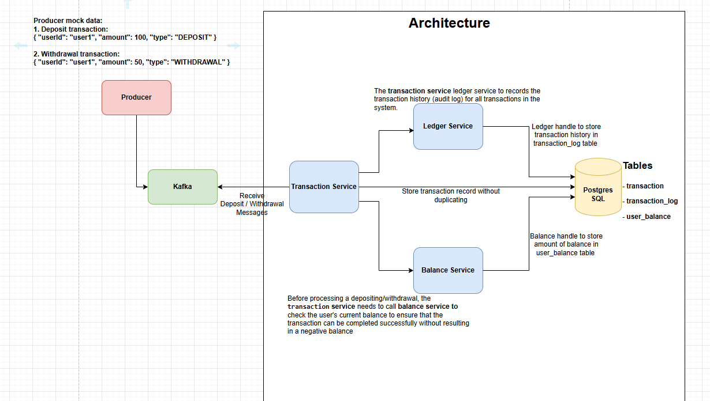

# Test Assessment

## Overview

This project is a Spring Boot application that processes transactions using Kafka. It includes services for handling transactions and managing user balances.




## Prerequisites

- Docker
- Java 8 or higher
- Maven
- PostgreSQL


## 1. Start Docker Containers
Open a terminal and navigate to the root directory of your project where the `docker-compose.yml` file is located.

Run the following command to start the Docker containers:
```sh
docker-compose up -d
```

## 2. Running Services Individually

### Install asset module
To install the `asset` module, please open a terminal and run the following command:

```sh
cd asset-module
```
Install the `asset-module`
```sh
mvn clean install
```

### Transaction Service (Port 8080)
To start the `transaction-service` on port `8080`, please open a terminal and run the following command:

Open `transaction-service` directory

```sh
cd transaction-service
```

Run the `transaction-service`

```sh
mvn spring-boot:run
```

### Ledger Service (Port 8081)

To start the `ledger-service` on port `8081`, please open a terminal and run the following command:

Open `ledger-service` directory

```sh
cd transaction-service
```

Run the `ledger-service`

```sh
mvn spring-boot:run
```

### Balance Service (Port 8082)

To start the `balance-service` on port `8082`, please open a terminal and run the following command:

Open `balance-service` directory

```sh
cd balance-service
```

Run the `balance-service`

```sh
mvn spring-boot:run
```

## 3. Accessing a Kafka container in Docker

To access a Kafka container in Docker, please open a terminal and run the following command:

```sh
docker exec - it broker sh
```

Start a Kafka console producer with `transaction-topic`, please run the following command:

```sh
kafka-console-producer --bootstrap-server localhost:9092 --topic transaction-topic
```

Send messages to a `transaction-topic`, please run the following command:

#### DEPOSIT:

```sh
{ "userId": "user1", "amount": 100, "type": "DEPOSIT" }
```

#### WITHDRAW:

```sh
{ "userId": "user1", "amount": 50, "type": "WITHDRAWAL" }
```
